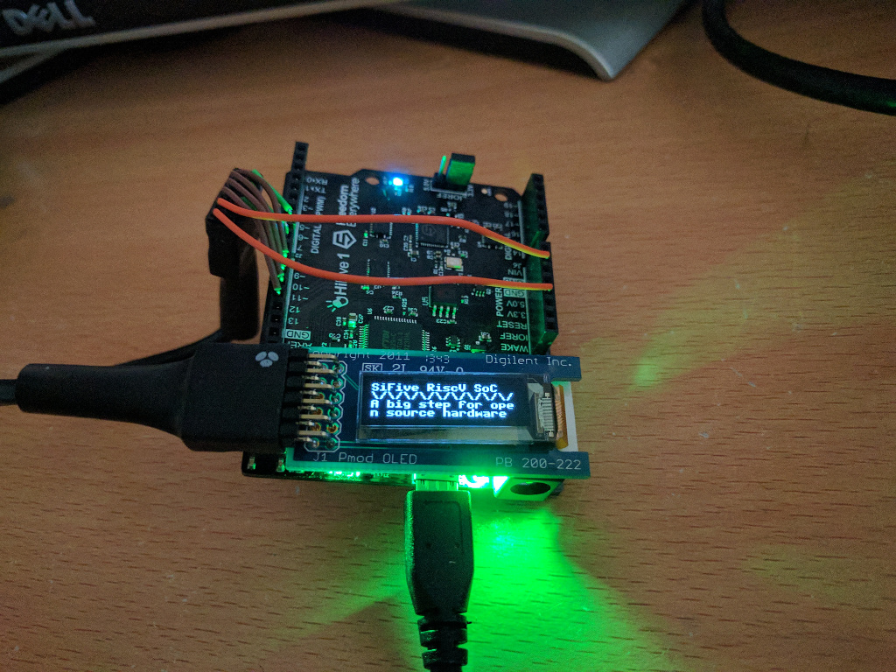

Drive Digilent pmodOLED module from a HiFive board

 - SPI interface attached via GPIO pins. Uses SiFive SPI device, or alternatively
   simple GPIO bitbanging.
 - SSD1306 controller.
 - 128x32 display.



(note: this is an older version of the software when the wiring was different).

Wiring
--------

See [pmodoled.c](pmodoled.c) under "Wiring" how to wire connect the PMOD to the
GPIO pins.

Usage
----------

- Build the [freedom-e-sdk](https://github.com/sifive/freedom-e-sdk)
- Check out this repository into the `software` subdirectory.
```bash
cd software
git clone https://github.com/laanwj/pmodoled.git
cd ..
```
- Compile
```
make software PROGRAM=pmodoled
```
Alternatively you can run `make -C software/pmodoled` yourself. This is useful
during incremental development as no automatic `make clean` will be run.

- Upload program to device
```
make upload PROGRAM=pmodoled
```

The program will automatically launch and display "test" on the display,
and log a bit of debug information to the UART.

The device will act as a simple terminal: everything you enter on the
serial console will be printed to the display. Newline and backspace should
work as expected.
